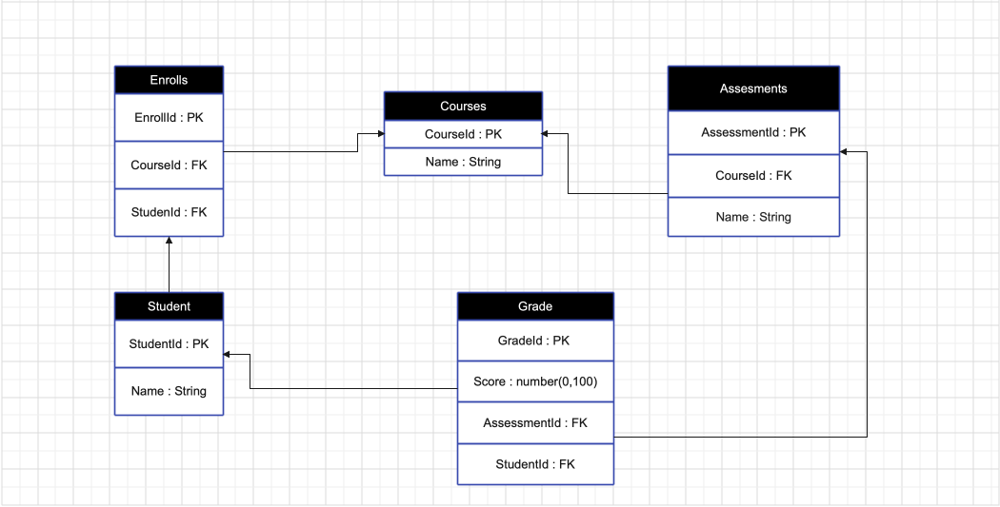

# Course Management System

You are asked to design a course management system. This system will help the faculty manage many courses, along with the enrolled students in each of the courses, and track their assignments.

## Requirements

This assessment has to be done in Python language.

You will find a service interface at `app/course_service.py`, please implement this service interface in file `app/course_service_impl.py`. All of the methods that are annotated by `@abstractmethod` must be implemented. The method comments would give you some basic clues about what these methods are expected to do.

Here are more details and requirements about this assessment:

- The system will manage courses:
  - Each course would have a name
  - Each course could have an unlimited number of assignments
- The system will be able to enroll students into courses:
  - Each student could enroll an unlimited number of courses
- The grade of a student's assignment will be an interger from 0 to 100, inclusive
- Feel free to add any new files to the project as you need them
- **_For simplicity, please do not use any external persistence for this assessment. Please choose the proper memory-based data structures you see fit for any data persistence need_**
- Please also include unit tests to make sure your implementation is testable
- Please feel free to ask any clarification questions

## Evaluation

The evaluation of this assessment will be mainly focusing on:

- Software architectural design
- Correctness of the solution (whether it meets the requirements)
- Maintainability of the code
- Readability of the code

In order to achieve excellence in these criteria, you can make reasonable assumptions,
or just ask us for any clarification questions.

## Submission

Please clone this repo and finish your implementation based on the requirements.

You can submit your assessment by either way:

- Create a public GitHub repository and send us the URL for it
- Zip your solution and email it back to us

## HOW TO RUN

- `pip3 install -r requirements.txt`
- `python3 main.py`

## UML DIAGRAM

## RUN TESTS

- `pytest`
